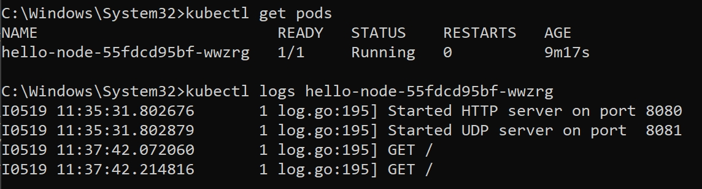

> Fari Hafizh Ramadhan - 2206083691

# Modul 11: Deployment on Kubernetes

### Hello minikube
1. ***Compare the application logs before and after you exposed it as a Service. Try to open the app several times while the proxy into the Service is running. What do you see in the logs? Does the number of logs increase each time you open the app?*** 
Dari log terlihat bahwa sebelum aplikasi di-expose sebagai sebuah service, aplikasi tersebut diakses langsung di dalam pod. Log menunjukkan pesan awal seperti (start server HTTP on port 8080) dan setiap permintaan yang masuk (GET /). Setiap kali aplikasi diakses di dalam pod, sebuah entri log dibuat untuk permintaan tersebut. Setelah aplikasi dijadikan service dengan menggunakan minikube service hello-node, log tetap menunjukkan pesan-pesan awal dan permintaan yang masuk seperti sebelumnya, namun sekarang aplikasi diakses melalui service yang meneruskan traffic ke pod. Mengakses aplikasi melalui service memungkinkan akses eksternal ke aplikasi, sedangkan mengaksesnya di dalam pod lebih bersifat internal dalam cluster Kubernetes.

 
2.***Notice that there are two versions of kubectl get invocation during this tutorial section. The first does not have any option, while the latter has -n option with value set to `kube-system`. What is the purpose of the -n option and why did the output not list the pods/services that you explicitly created?*** 
Opsi -n dalam perintah kubectl get digunakan untuk menentukan namespace dari mana resource akan ditampilkan. Jika tidak menggunakan opsi -n, kubectl get akan menampilkan resource dari namespace default. Pada pemanggilan berikutnya, kubectl get digunakan dengan opsi -n kube-system, yang menginstruksikannya untuk menampilkan resource dari namespace kube-system secara khusus. Namespace ini mencakup komponen sistem dan infrastruktur Kubernetes itu sendiri, seperti layanan inti sistem seperti DNS, server API, dan dashboard Kubernetes.
