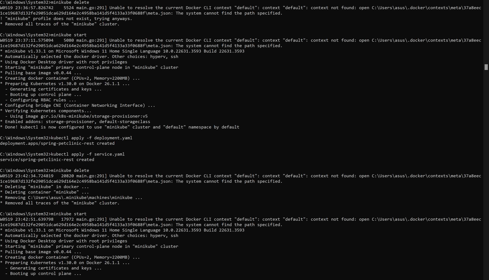

> Fari Hafizh Ramadhan - 2206083691

# Modul 11: Deployment on Kubernetes

### Hello minikube
1. ***Compare the application logs before and after you exposed it as a Service. Try to open the app several times while the proxy into the Service is running. What do you see in the logs? Does the number of logs increase each time you open the app?***<br>
Dari log terlihat bahwa sebelum aplikasi di-expose sebagai sebuah service, aplikasi tersebut diakses langsung di dalam pod. Log menunjukkan pesan awal seperti (start server HTTP on port 8080) dan setiap permintaan yang masuk (GET /). Setiap kali aplikasi diakses di dalam pod, sebuah entri log dibuat untuk permintaan tersebut. Setelah aplikasi dijadikan service dengan menggunakan minikube service hello-node, log tetap menunjukkan pesan-pesan awal dan permintaan yang masuk seperti sebelumnya, namun sekarang aplikasi diakses melalui service yang meneruskan traffic ke pod. Mengakses aplikasi melalui service memungkinkan akses eksternal ke aplikasi, sedangkan mengaksesnya di dalam pod lebih bersifat internal dalam cluster Kubernetes.

<br><br>
2.***Notice that there are two versions of kubectl get invocation during this tutorial section. The first does not have any option, while the latter has -n option with value set to `kube-system`. What is the purpose of the -n option and why did the output not list the pods/services that you explicitly created?***<br>
Opsi -n dalam perintah kubectl get digunakan untuk menentukan namespace dari mana resource akan ditampilkan. Jika tidak menggunakan opsi -n, kubectl get akan menampilkan resource dari namespace default. Pada pemanggilan berikutnya, kubectl get digunakan dengan opsi -n kube-system, yang menginstruksikannya untuk menampilkan resource dari namespace kube-system secara khusus. Namespace ini mencakup komponen sistem dan infrastruktur Kubernetes itu sendiri, seperti layanan inti sistem seperti DNS, server API, dan dashboard Kubernetes.

### Rolling Update & Kubernetes Manifest File
1. ***What is the difference between Rolling Update and Recreate deployment strategy?***<br>
Perbedaan antara strategi Rolling Update dan Recreate Deployment terletak pada bagaimana mereka menangani pembaruan aplikasi dan downtime selama proses tersebut. Dalam Recreate Deployment, terjadi downtime karena semua pod dari versi aplikasi sebelumnya dihentikan terlebih dahulu sebelum pod baru dengan versi terbaru dibuat. Ini berarti bahwa selama jeda antara penghapusan pod lama dan pembuatan pod baru, aplikasi tidak tersedia. Sebaliknya, Rolling Update menghindari downtime dengan memperbarui aplikasi secara bertahap. Pod baru dengan versi terbaru dibuat satu per satu, sementara pod lama masih berjalan. Dengan cara ini, Rolling Update memastikan aplikasi tetap online selama pembaruan tanpa mengalami waktu tidak tersedia.
<br><br>
2. ***Try deploying the Spring Petclinic REST using Recreate deployment strategy and document your attempt.***


<br><br>
3. ***Prepare different manifest files for executing Recreate deployment strategy.***<br>
```
apiVersion: apps/v1
kind: Deployment
metadata:
  annotations:
    deployment.kubernetes.io/revision: "3"
  creationTimestamp: "2024-05-19T15:42:03Z"
  generation: 4
  labels:
    app: spring-petclinic-rest
  name: spring-petclinic-rest
  namespace: default
  resourceVersion: "12597"
  uid: fa8fd21b-802d-4b0c-a198-04b4feea09b4
spec:
  progressDeadlineSeconds: 600
  replicas: 4
  revisionHistoryLimit: 10
  selector:
    matchLabels:
      app: spring-petclinic-rest
  strategy:
    rollingUpdate:
      maxSurge: 25%
      maxUnavailable: 25%
    type: RollingUpdate
  template:
    metadata:
      creationTimestamp: null
      labels:
        app: spring-petclinic-rest
    spec:
      containers:
      - image: docker.io/springcommunity/spring-petclinic-rest:3.0.2
        imagePullPolicy: IfNotPresent
        name: spring-petclinic-rest
        resources: {}
        terminationMessagePath: /dev/termination-log
        terminationMessagePolicy: File
      dnsPolicy: ClusterFirst
      restartPolicy: Always
      schedulerName: default-scheduler
      securityContext: {}
      terminationGracePeriodSeconds: 30
status:
  availableReplicas: 4
  conditions:
  - lastTransitionTime: "2024-05-19T15:44:07Z"
    lastUpdateTime: "2024-05-19T15:44:07Z"
    message: Deployment has minimum availability.
    reason: MinimumReplicasAvailable
    status: "True"
    type: Available
  - lastTransitionTime: "2024-05-19T16:22:25Z"
    lastUpdateTime: "2024-05-19T16:22:25Z"
    message: ReplicaSet "spring-petclinic-rest-744fbd68bc" has successfully progressed.
    reason: NewReplicaSetAvailable
    status: "True"
    type: Progressing
  observedGeneration: 4
  readyReplicas: 4
  replicas: 4
  updatedReplicas: 4
```
<br>
4. ***What do you think are the benefits of using Kubernetes manifest files? Recall your experience in deploying the app manually and compare it to your experience when deploying the same app by applying the manifest files (i.e., invoking `kubectl apply -f` command) to the cluster.***<br>
Menggunakan manifest files membuat proses deployment lebih terstandardisasi dan terdokumentasi secara deklaratif, sehingga mengurangi risiko kesalahan manusia karena tidak perlu mengingat prosedur spesifik. Manifest files juga memudahkan pengelolaan konfigurasi aplikasi secara efisien, menghilangkan kebutuhan akan setup manual yang memakan waktu bagi pengguna.
<br><br>
5. ***(Optional) Do the same tutorial steps, but on a managed Kubernetes cluster (e.g., GCP). You need to provision a Kubernetes cluster on Google Cloud Platform. Then, re-run the tutorial steps (Hello Minikube and Rolling Update) on the remote cluster. Document your attempt and highlight the differences and any issues you encountered.***